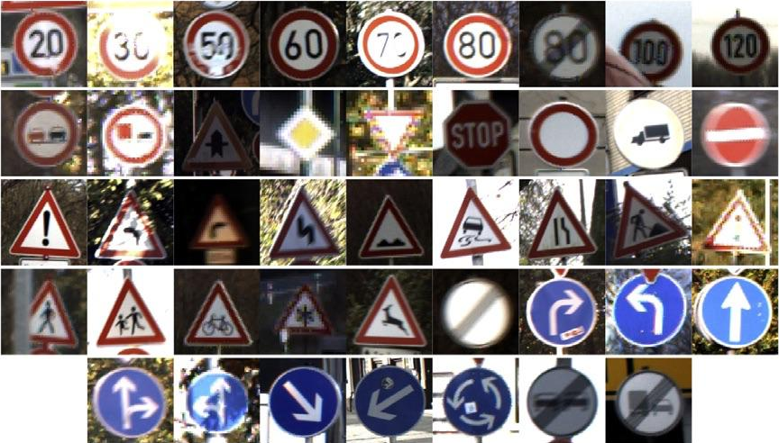

# Lane Segmentation and Object Detection/Classification

In this project, we aim to *Lane Segmentation* and *Traffic Signs Classification* in the images.

Some of the technologies used in the project; **Python, OpenCV, Pytorch, TensorFlow, YOLOv4**

The results of the project can be viewed in the video below;

In training Lane Segmentation and Traffic Sign Detection models, 8.555 image data collected from the highway by Ford Otosan were used. Examples from the dataset;

 

In the traffic sign classification model, the [German Traffic Sign dataset](https://www.kaggle.com/meowmeowmeowmeowmeow/gtsrb-german-traffic-sign) from Kaggle was used. Data were collected for traffic signs specific to Turkish highways and new classes were added to the dataset. It has 40+ classes and 50,000+ image data.
Examples from the dataset;

 

### The project consists of 2 main parts;
- [Lane Segmentation](#lane-segmentation)
- [Traffic Sign Detection and Classification](#traffic-sign-detection-and-classification)

## Lane Segmentation

Many steps in the Lane Segmentation section have the same content as the Drivable Area Segmentation project.

**[Click for the GitHub repository of the Drivable Area Detection project. ](https://github.com/recepayddogdu/Freespace_Segmentation-Ford_Otosan_Intern)**

### Json to Mask
JSON files are obtained as a result of highway images labeled by Ford Otosan Annotation Team. The JSON files contain the locations of the *Solid Line* and *Dashed Line* classes.

A mask was created with the data in the JSON file to identify the pixels of the lines in the image.

The `fillPoly` function from the cv2 library was used to draw the masks.

    for obj in json_dict["objects"]: #To access each list inside the json_objs list                   
        if obj['classTitle']=='Solid Line':
           cv2.polylines(mask,np.array([obj['points']['exterior']],dtype=np.int32),False,color=1,thickness=14)
        elif obj['classTitle']=='Dashed Line':       
               cv2.polylines(mask,np.array([obj['points']['exterior']],dtype=np.int32),False,color=2,thickness=9)

Mask example;

 

**Click for the codes of this section;**  [json2mask_line.py](https://github.com/recepayddogdu/Object_Detection_Classification_-_Ford_Otosan_Intern_P2/blob/master/src/Line_Segmentation/json2mask_line.py), [mask_on_image.py](https://github.com/recepayddogdu/Object_Detection_Classification_-_Ford_Otosan_Intern_P2/blob/master/src/Line_Segmentation/mask_on_image.py)

