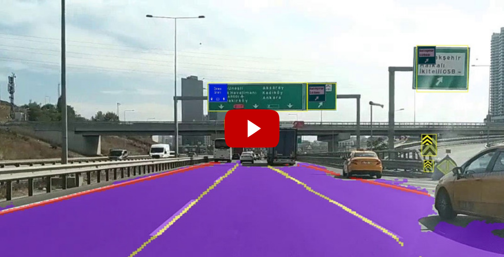

# Line Segmentation and Object Detection/Classification

In this project, we aim to line segmentation and traffic signs classification in the images.

Some of the technologies used in the project; Python, OpenCV, Pytorch, TensorFlow, YOLOv4

**[Click for the GitHub repository of the Drivable Area Detection project. ](https://github.com/recepayddogdu/Freespace_Segmentation-Ford_Otosan_Intern)**

The results of the project can be viewed in the video below;

The project consists of 2 main parts.
- [Line Segmentation](#line-segmentation)
- [Traffic Sign Detection and Classification](#traffic-sign-detection-and-classification)

