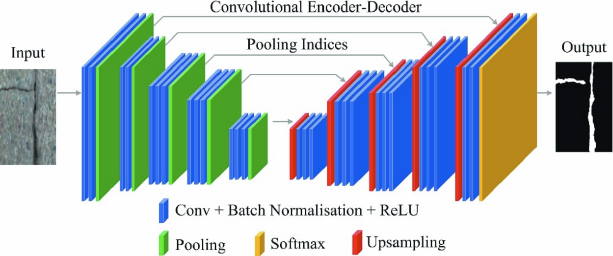

# Lane Segmentation and Object Detection/Classification

In this project, *Lane Segmentation* and *Traffic Sign Detection/Classification* are aimed in the images.

Some of the technologies used in the project; **Python, OpenCV, Pytorch, TensorFlow, YOLOv4**

The results of the project can be viewed in the video below;

In training Lane Segmentation and Traffic Sign Detection models, 8.555 image data collected from the highway by Ford Otosan were used.  
Examples from the dataset;

 

In the traffic sign classification model, the [German Traffic Sign dataset](https://www.kaggle.com/meowmeowmeowmeowmeow/gtsrb-german-traffic-sign) from Kaggle was used. Data were collected for traffic signs specific to Turkish highways and new classes were added to the dataset. It has 40+ classes and 50,000+ image data.  
Examples from the dataset;

 

### The project consists of 2 main parts;
- [Lane Segmentation](#lane-segmentation)
- [Traffic Sign Detection and Classification](#traffic-sign-detection-and-classification)

## Lane Segmentation

Many steps in the Lane Segmentation section have the same content as the Drivable Area Segmentation project.

**[Click for the GitHub repository of the Drivable Area Detection project. ](https://github.com/recepayddogdu/Freespace_Segmentation-Ford_Otosan_Intern)**

### Json to Mask
JSON files are obtained as a result of highway images labeled by Ford Otosan Annotation Team. The JSON files contain the locations of the *Solid Line* and *Dashed Line* classes.

A mask was created with the data in the JSON file to identify the pixels of the lines in the image.

The `fillPoly` function from the cv2 library was used to draw the masks.

    for obj in json_dict["objects"]: #To access each list inside the json_objs list                   
        if obj['classTitle']=='Solid Line':
           cv2.polylines(mask,np.array([obj['points']['exterior']],dtype=np.int32),  
           False,color=1,thickness=14)
        elif obj['classTitle']=='Dashed Line':       
           cv2.polylines(mask,np.array([obj['points']['exterior']],dtype=np.int32),  
           False,color=2,thickness=9)

Mask example;

 

**Click for the codes of this section;**  [json2mask_line.py](https://github.com/recepayddogdu/Object_Detection_Classification_-_Ford_Otosan_Intern_P2/blob/master/src/Line_Segmentation/json2mask_line.py), [mask_on_image.py](https://github.com/recepayddogdu/Object_Detection_Classification_-_Ford_Otosan_Intern_P2/blob/master/src/Line_Segmentation/mask_on_image.py)

### Model
SegNet was used as we got better results in lanes. U-Net was used for Drivable Area Segmentation. In this way, different models were experienced.

**SegNet** is a semantic segmentation model. This core trainable segmentation architecture consists of an encoder network, a corresponding decoder network followed by a pixel-wise classification layer. The architecture of the encoder network is topologically identical to the 13 convolutional layers in the VGG16 network. The role of the decoder network is to map the low resolution encoder feature maps to full input resolution feature maps for pixel-wise classification. The novelty of SegNet lies is in the manner in which the decoder upsamples its lower resolution input feature maps. Specifically, the decoder uses pooling indices computed in the max-pooling step of the corresponding encoder to perform non-linear upsampling.

 

*SegNet architecture. There are no fully connected layers and hence it is only convolutional. A decoder upsamples its input using the transferred pool indices from its encoder to produce a sparse feature map(s). It then performs convolution with a trainable filter bank to densify the feature map. The final decoder output feature maps are fed to a soft-max classifier for pixel-wise classification.*

**Click for the codes of this section;  [SegNet.py](https://github.com/recepayddogdu/Object_Detection_Classification_-_Ford_Otosan_Intern_P2/blob/master/src/Lane_Segmentation/SegNet.py)**

### Predict
To see the results of the trained model, estimation was done with test data never seen before by the model.

The images in the test data set are converted to tensor. It is given to the model. And the outputs are converted to masks. Then, these masks are printed on the images and the results are observed.

 

**Click for the codes of this section;  [full_predict.py](https://github.com/recepayddogdu/Object_Detection_Classification_-_Ford_Otosan_Intern_P2/blob/master/src/Lane_Segmentation/full_predict.py)**

**You can review my notes, which contain basic information about semantic segmentation and deep learning; [Questions and Answers](https://github.com/recepayddogdu/Freespace_Segmentation-Ford_Otosan_Intern/blob/main/Questions_and_Answers.md#questions-and-answers)**

## Traffic Sign Detection and Classification

This section consists of 2 subtitles.

- [Traffic Sign Detection](#traffic-sign-detection)
- [Traffic Sign Classification](#traffic-sign-classification)

First, the location of the traffic sign is determined in the image. The image is cropped according to the detected location, the cropped image is classified.

For basic information about this section, you can view my notes under the following headings;

- [What is an image classification task?](/q&a.md#what-is-an-image-classification-task)
- [What is an object localization task?](/q&a.md#what-is-an-object-localization-task)
- [What is an object detection task?](/q&a.md#what-is-an-object-detection-task)
- [What is an object recognition task?](/q&a.md#what-is-an-object-recognition-task)
- [What is non-max suppression?](/q&a.md#what-is-non-max-suppression)
- [YOLO Object Detection Model](/q&a.md#yolo-object-detection-model)

### Traffic Sign Detection

The YOLOv4 model, which is very popular today, was used for object detection.

JSON files are obtained as a result of highway images labeled by Ford Otosan Annotation Team. The JSON files contain the locations of the Traffic Sign class.

Data labels have been adjusted to the YOLOv4 model.

    xmin=obj['points']['exterior'][0][0]
    ymin=obj['points']['exterior'][0][1]
    xmax=obj['points']['exterior'][1][0]
    ymax=obj['points']['exterior'][1][1]
                    
    def width():
        width=int(xmax-xmin)
        return width
    def height():
        height=int(ymax-ymin)
        return height
    def x_center():
        x_center=int(xmin + width()/2)
        return x_center
    def y_center():
        y_center=int(ymin + height()/2)
        return y_center
    annotations.append(str(obj_id)+" "+str(x_center()/1920)+" "+str(y_center()/1208)  
				    +" "+str(width()/1920)+" "+str(height()/1208))

The folder structure of the train and validation data to be used in the model;

 

txt files contain the classes and coordinates of the data;

 

Model parameters have been updated according to our dataset;

 

 

Before starting the model training, the pre-trained model weights were downloaded. In this way, the training time was shortened and more accurate operation was ensured.

    def Detection(imageDir):
    os.system("./darknet detector test data/obj.data cfg/yolov4-obj.cfg ../yolov4-obj_last.weights  
			   {} -ext_output -dont_show -out result.json -thresh 0.5".format(imageDir))

