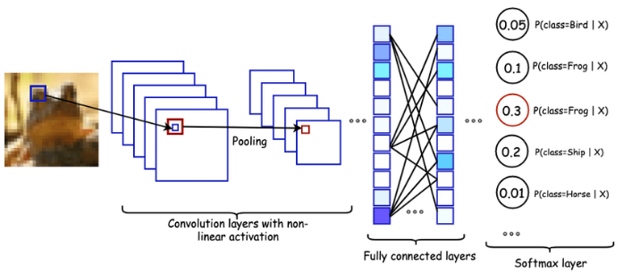
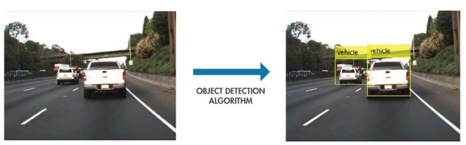

# Questions and Answers
## Contents
- [What is an image classification task?](#what-is-an-image-classification-task)
- [What is an object localization task?](#what-is-an-object-localization-task)
- [What is an object detection task?](#what-is-an-object-detection-task)
- [What is an object recognition task?](#what-is-an-object-recognition-task)
- [What is non-max suppression?](#what-is-non-max-suppression)
- [Yolo Object Detection Model](#yolo-object-detection-model)

## What is an image classification task?
Image classification is where a computer can analyse an image and identify the ‘class’ the image falls under. (Or a probability of the image being part of a ‘class’.) A class is essentially a label, for instance, ‘car’, ‘animal’, ‘building’ and so on.  

For example, you input an image of a sheep. Image classification is the process of the computer analysing the image and telling you it’s a sheep. (Or the probability that it’s a sheep.)

 

## What is an object localization task?

The task of object localization is to predict the object in an image as well as its boundaries. The difference between object localization and object detection is subtle. Simply, object localization aims to locate the main (or most visible) object in an image while object detection tries to find out all the objects and their boundaries.

 

## What is an object detection task?

Object detection is a key technology behind advanced driver assistance systems (ADAS) that enable cars to detect driving lanes or perform pedestrian detection to improve road safety.

 

### How it works?

You can use a variety of techniques to perform object detection. Popular deep learning–based approaches using convolutional neural networks (CNNs), such as R-CNN and YOLO v2, automatically learn to detect objects within images.

You can choose from two key approaches to get started with object detection using deep learning:

-   **Create and train a custom object detector.**  To train a custom object detector from scratch, you need to design a network architecture to learn the features for the objects of interest. You also need to compile a very large set of labeled data to train the CNN. The results of a custom object detector can be remarkable. That said, you need to manually set up the layers and weights in the CNN, which requires a lot of time and training data.
-   **Use a pretrained object detector.**  Many object detection workflows using deep learning leverage  [transfer learning](https://blogs.mathworks.com/pick/2017/02/24/deep-learning-transfer-learning-in-10-lines-of-matlab-code/), an approach that enables you to start with a pretrained network and then fine-tune it for your application. This method can provide faster results because the object detectors have already been trained on thousands, or even millions, of images.

 

## What is an object recognition task?

Object recognition is a computer vision technique for identifying objects in images or videos. Object recognition is a key output of deep learning and machine learning algorithms. When humans look at a photograph or watch a video, we can readily spot people, objects, scenes, and visual details. The goal is to teach a computer to do what comes naturally to humans: to gain a level of understanding of what an image contains.

 

Object recognition is a key technology behind driverless cars, enabling them to recognize a stop sign or to distinguish a pedestrian from a lamppost. It is also useful in a variety of applications such as disease identification in bioimaging, industrial inspection, and robotic vision.

## What is non-max suppression?

Non Maximum Suppression (NMS) is a technique used in numerous computer vision tasks. It is a class of algorithms to select one entity (e.g., bounding boxes) out of many overlapping entities. We can choose the selection criteria to arrive at the desired results. The criteria are most commonly some form of probability number and some form of overlap measure (e.g. Intersection over Union).

 

Most object detection algorithms use NMS to whittle down many detected bounding boxes to only a few. At the most basic level, most object detectors do some form of  **windowing**. Thousands of windows (anchors) of various  **sizes and shapes**  are generated.

These windows supposedly contain  **only one object**, and a classifier is used to obtain a  **probability/score for each class**. Once the detector outputs a  **large number of bounding boxes**, it is necessary to **filter out the best ones**.  **NMS**  is the most commonly used algorithm for this task.

## Yolo Object Detection Model

**YOLO**  (You Only Look Once) is a real-time object detection algorithm developed by Joseph Redmon in 2015 which at the time is a state-of-the-art object detection algorithm (and still is!). Prior to YOLO, detection algorithms use classifiers to perform detection where they apply the model to an image at multiple locations and scales, and they consider detection on the high scoring regions of the image. This process is computationally expensive and they are not able to perform well in real-time using ‘your average laptop’. YOLO uses a different approach to object detection, according to the original paper:

We frame object detection as a regression problem to spatially separated bounding boxes and associated class probabilities. A single neural network predicts bounding boxes and class probabilities directly from full images in one evaluation. Since the whole detection pipeline is a single network, it can be optimized end-to-end directly on detection performance.

Our unified architecture is extremely fast. Our base YOLO model processes images in real-time at 45 frames per second. A smaller version of the network, Fast YOLO, processes an astounding 155 frames per second while still achieving double the mAP of other real-time detectors.

Compared to state-of-the-art detection systems, YOLO makes more localization errors but is far less likely to predict false detections where nothing exists. Finally, YOLO learns very general representations of objects. It outperforms all other detection methods, including DPM and R-CNN, by a wide margin when generalizing from natural images to artwork on both the Picasso Dataset and the People-Art Dataset.

The model works by first splitting the input image into a grid of cells, where each cell is responsible for predicting a bounding box if the center of a bounding box falls within the cell. Each grid cell predicts a bounding box involving the x, y coordinate and the width and height and the confidence. A class prediction is also based on each cell.

For example, an image may be divided into a 7×7 grid and each cell in the grid may predict 2 bounding boxes, resulting in 94 proposed bounding box predictions. The class probabilities map and the bounding boxes with confidences are then combined into a final set of bounding boxes and class labels.

 

### YOLOv4 Model
YOLOv4 was a real-time object detection model published in April 2020 that achieved state-of-the-art performance on the COCO dataset. It works by breaking the object detection task into two pieces, regression to identify object positioning via bounding boxes and classification to determine the object's class. This implementation of YoloV4 uses the Darknet framework. YOLOv4 is pre-trained on the COCO dataset with 80 classes that it can predict.

By using YOLOv4, you are implementing many of the past research contributions in the YOLO family along with a series of new contributions unique to YOLOv4 including new features: WRC, CSP, CmBN, SAT, Mish activation, Mosaic data augmentation, CmBN, DropBlock regularization, and CIoU loss. In short, with YOLOv4, you're using a better object detection network architecture and new data augmentation techniques.

##### YOLOv4 Architecture

 

##### YOLOv4 Results

As can be seen in the results below, YOLOv4 has an incredibly high performance for a very high FPS; this was a major improvement from previous object detection models which only had either high performance or high inference speeds.

 

#### The COCO Dataset

[The COCO dataset](https://blog.roboflow.com/coco-dataset/)  is the gold standard benchmark for evaluating object detection models. The COCO (Common Objects in Context) dataset contains over 120,000 images for training and testing, with 80 object class labels that are commonly observed in everyday life. Generally, if a model does well on the COCO dataset, it is believed that the model will generalize well to new custom domains.
